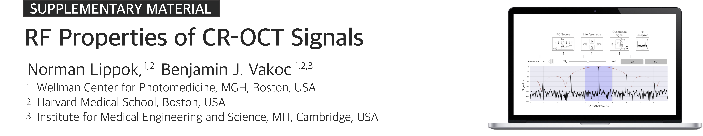

<!-- 
Norman Lippok1,2, Benjamin J. Vakoc1,2,3  
<i>1Wellman Center for Photomedicine, Massachusetts General Hospital, Boston, MA 02114, USA 
2Harvard Medical School, Boston, MA 02115, USA 
3Institute for Medical Engineering and Science, Massachusetts Institute of Technology, Cambridge, MA 02139, USA 
</i> 
-->

This GitHub repository contains Supplementary Material to our paper entitled *RF Properties of Circular-Ranging OCT Signals*. Please note the comments below.
* The link below initiates a self-running simulation based on Jupyter Notebook (Python3). No installation of Jupiter Notebooks, Python or prior knowledge of Pyton is required.
* Starting the server (based on <a href="https://mybinder.org" target="_blank">MyBinder</a>) for the first time may take up to 10 minutes.
* Optionally, the Notebook (`Notebook.ipynb`) can be downloaded from the directory above and run in your own Jupyter Notebook environment. Note that all files inside the folder are required to run the simulation. Running the Notebook externally requires the installation of Jupyter Notebook and Python3. We recommend using <a href="https://www.anaconda.com/products/individual" target="_blank">Anaconda</a>, which is free. 

 

| PART 1 | PART 2 | PART 3 |
| :--- | :--- | :--- |
| <a href="https://mybinder.org/v2/gh/nlippok/Notebooks-CR-OCT-Sampling-public/HEAD?urlpath=%2Fvoila%2Frender%2FPart1%2FNotebook.ipynb" target="_blank">CR-OCT signals</a> | Nyquist sampling: <a href="https://mybinder.org/v2/gh/nlippok/Notebooks-CR-OCT-Sampling-public/HEAD?urlpath=%2Fvoila%2Frender%2FPart2%2FPhase%2FNotebook.ipynb" target="_blank">Acquisition clock phase</a> | Oversampling: <a href="https://mybinder.org/v2/gh/nlippok/Notebooks-CR-OCT-Sampling-public/HEAD?urlpath=%2Fvoila%2Frender%2FPart3%2FArtefacts%2FNotebook.ipynb" target="_blank">Aliasing artefacts</a> |
| | Nyquist sampling: <a href="https://mybinder.org/v2/gh/nlippok/Notebooks-CR-OCT-Sampling-public/HEAD?urlpath=%2Fvoila%2Frender%2FPart2%2FSNR%2FNotebook.ipynb" target="_blank">Analog low-pass filter</a> | Minimal oversampling: <a href="https://mybinder.org/v2/gh/nlippok/Notebooks-CR-OCT-Sampling-public/HEAD?urlpath=%2Fvoila%2Frender%2FPart3%2FMinimal%20oversampling%2FNotebook1.ipynb" target="_blank">Aliasing artefacts</a> |
| | | Oversampling: <a href="https://mybinder.org/v2/gh/nlippok/Notebooks-CR-OCT-Sampling-public/HEAD?urlpath=%2Fvoila%2Frender%2FPart3%2FRoll-off%2FNotebook.ipynb" target="_blank">Roll-off compensation</a> | 

 
This GitHub directory can be opened in a Jupyter enviornment using the link below.

